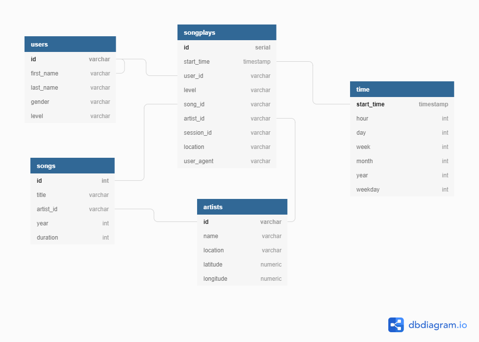

# Data Modeling with Postgres
## By David Miller

## How to Run the Python Scripts in Command Line
1. First sure you've navigated to the directory where the project is located
2. Run `python create_tables.py` to create the tables within the database
3. Run `python etl.py` to grab, process and store the data in the tables you just created

## Project Overview
## Part I - Defining the Schema
* Below is a a diagram depicting the schema for the database in this project

## Part II - Writing the Queries
* Before doing anything else, writing the queries that create the tables and insert data into said tables, but also dropping them if they exist so as not to create duplicate tables is key
* This is all done in `sql_queries.py`
* It is all mostly written in raw SQL, but both the create and insert queries are stored within lists to easily iterate over later
* All of the Python logic to create the tables was already put in place by Udacity in `create_tables.py`
    * All its doing is just that creating and dropping the tables! The functions doing the work establish a connection to the database, executes the create and drop queries written in `sql_queries.py`, then commits those changes so that they're made permanent
    * Then the `main` method calls the two defined functions above, and is actually run in the last line of the file

## Part II - Extract, Transform and Load!
* This is where the bulk of the project was done by me
* Most of the initial QA, experimentaiton was done in the interactive notebook `etl.ipynb`, but later debugged in the command line
    * A lot of the logic in here was prebuilt by Udacity, which I didn't change much. It was only later that I decided to rewrite code in `etl.py` when it became apparent there were issues the code template weren't handling very well
* Essentially, the data is initially stored in several separate files, the're grabbed and combined to create two raw data tables
* Then they're split into 5 separate tables for ingestion
* Before doing this however, duplicates needed to be handled and some data/cleaning transformation was necessary too
    * Time data needed to converted and pulled out to create the time table
    * Additionally there was a userId column in one of the tables that had numbers stored as both strings and integers, which fooled a Pandas duplicates method, but not Postgres
* In `etl.py` I decided to rework the logic written by Udacity to bulk load the data where possible instead of one by one. To do so I created a helper function to chunk the data so not too much would be thrown in at once
    * Additionally each load function was rewritten to take in all of the filepaths where the data was located rather than just one. 
    * This did not require as much rewriting as I thought it might!
